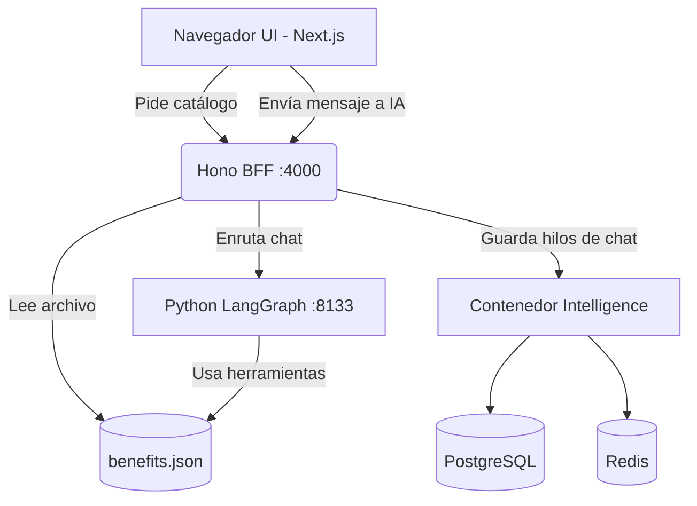

# Portal de Beneficios Dinámicos - Agentic UI


Bienvenido al **Portal de Beneficios Dinámicos**, una aplicación web inteligente construida para gestionar, visualizar y solicitar beneficios corporativos mediante una interfaz conversacional (Agentic UI).

Este proyecto transforma un clásico portal de recursos humanos en una experiencia dinámica donde un Agente de IA (potenciado por LangGraph y Gemini) asiste al usuario para consultar beneficios, e incluso tiene permisos de administrador para **crear nuevos beneficios** en tiempo real, reflejando los cambios inmediatamente en la interfaz.

---

## 🚀 Características Principales

- **Agente Conversacional Integrado:** Un asistente en el panel lateral capaz de responder dudas sobre los beneficios y ejecutar acciones como la creación de nuevos ítems en el catálogo.
- **Sincronización en Tiempo Real:** Las modificaciones realizadas por el agente (ej. crear un beneficio) actualizan directamente la base de datos (`benefits.json`) y la interfaz se refresca automáticamente sin necesidad de recargar la página.
- **UI Generativa Controlada:** Tarjetas de beneficios interactivas que responden al estado global del sistema.
- **Historial Persistente:** Las conversaciones con el agente y el estado de la aplicación se mantienen gracias al motor de inteligencia respaldado por PostgreSQL y Redis.

---

## 🏗️ Arquitectura del Sistema

El proyecto está dividido en un monorepo que orquesta múltiples servicios trabajando en conjunto:

### 1. Frontend (Next.js)
- **Ubicación:** `apps/frontend/`
- Interfaz principal donde los empleados exploran los beneficios. Usa React y TailwindCSS. 
- Implementa `CopilotKit` para la interacción transparente con el Agente de IA y se comunica con el BFF para mantener el estado fresco.

### 2. Backend for Frontend - BFF (Hono / Node.js)
- **Ubicación:** `apps/bff/`
- Servidor rápido construido con Hono.
- Actúa como puente entre el Frontend, el motor de CopilotKit, y el almacenamiento local.
- Expone los endpoints `/api/benefits` (para leer el catálogo) y el handler unificado `/api/copilotkit` para enrutar los mensajes hacia la IA.

### 3. Agente de IA (LangGraph / Python)
- **Ubicación:** `apps/agent/`
- La lógica "cerebral" del sistema. Utiliza **LangGraph** para orquestar flujos de trabajo multi-paso y **Gemini** como LLM principal.
- Posee "Tools" (Herramientas) programadas en Python que le permiten escribir directamente en `benefits.json` cuando el usuario solicita crear un beneficio.

### 4. Infraestructura (Docker)
- **Ubicación:** `deployment/docker-compose.yml`
- Proveedores de persistencia para el sistema CopilotKit Intelligence.
- Levanta contenedores de **PostgreSQL** y **Redis**, además del contenedor central `intelligence` que maneja las sesiones de chat, el historial y la concurrencia.



---

## 🛠️ Tecnologías Utilizadas

- **Frontend:** Next.js, React, TailwindCSS, CopilotKit.
- **Backend / API:** Hono, Node.js (`tsx`).
- **Agente de IA:** Python, LangGraph, LangChain, Google Gemini (`gemini-3.1-flash-lite`).
- **Base de Datos / Estado:** JSON (Catálogo), PostgreSQL + Redis (Hilos de chat vía Docker).

---

## ⚙️ Cómo ejecutar el proyecto localmente

### Prerrequisitos
- **Node.js 20+**
- **Python 3.10+** y `uv` instalado.
- **Docker Desktop** (Debe estar corriendo para levantar las bases de datos).

### Paso a paso

1. **Clonar e instalar dependencias**
   ```bash
   git clone https://github.com/agallardohub/ConfbeneficiosDinamicos.git
   cd ConfbeneficiosDinamicos
   npm install
   ```

2. **Configurar Variables de Entorno**
   Copia los archivos de ejemplo en la raíz y en la carpeta del agente:
   ```bash
   cp .env.example .env
   cp apps/agent/.env.example apps/agent/.env
   ```
   **Importante:** Asegúrate de rellenar el `GEMINI_API_KEY` en ambos archivos y tu licencia de `COPILOTKIT_LICENSE_TOKEN` en la raíz.

3. **Levantar todos los servicios**
   ```bash
   npm run dev
   ```
   *Este comando levantará automáticamente los contenedores Docker, el servidor UI, el BFF y el motor de Python usando `concurrently`.*

4. **Acceder a la aplicación**
   Abre tu navegador en: [http://localhost:3010/leads](http://localhost:3010/leads)

---

## 📂 Estructura del repositorio

```text
.
├── apps/
│   ├── agent/         # Lógica del Agente en Python (LangGraph, Prompts, Tools)
│   │   └── data/      # Directorio de persistencia donde vive benefits.json
│   ├── bff/           # Backend (Hono) para servir APIs proxy y el conector de CopilotKit
│   └── frontend/      # App web en Next.js (Páginas, Componentes React, Estilos)
├── deployment/        # Archivos de infraestructura (docker-compose.yml)
├── package.json       # Monorepo scripts (dev, dev:infra, dev:ui, dev:bff, dev:agent)
└── README.md          # Este documento
```

---

## 💡 Próximos pasos (Roadmap)

- [ ] Implementar herramienta para que el agente pueda **Eliminar** o **Editar** beneficios existentes.
- [ ] Conectar la acción de "Solicitar" beneficio con un sistema real de seguimiento (ej. Base de datos o Trello/Jira).
- [ ] Agregar autenticación (SSO) para que el agente reconozca quién está solicitando el beneficio.
- [ ] Despliegue en la nube (Vercel para UI, Render para el Agente y BFF).
